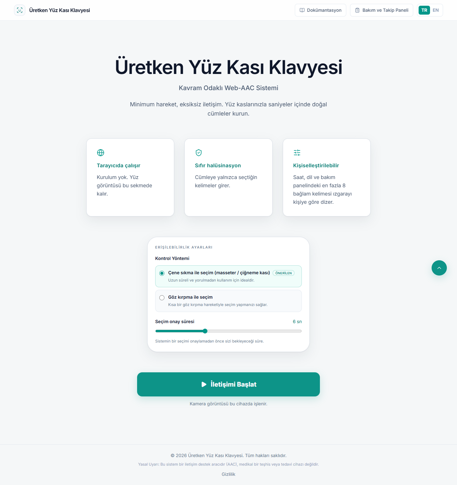
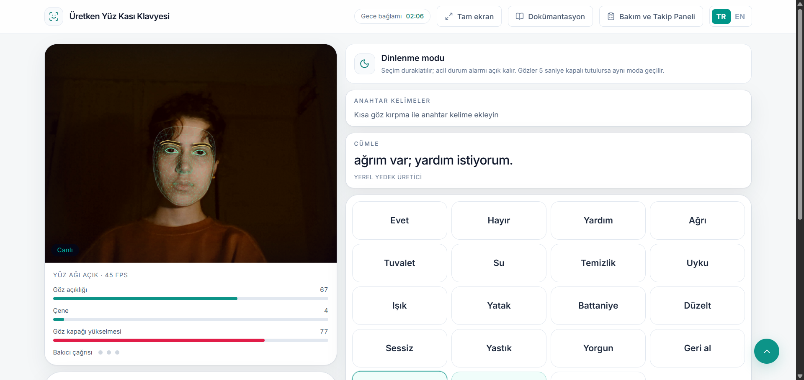
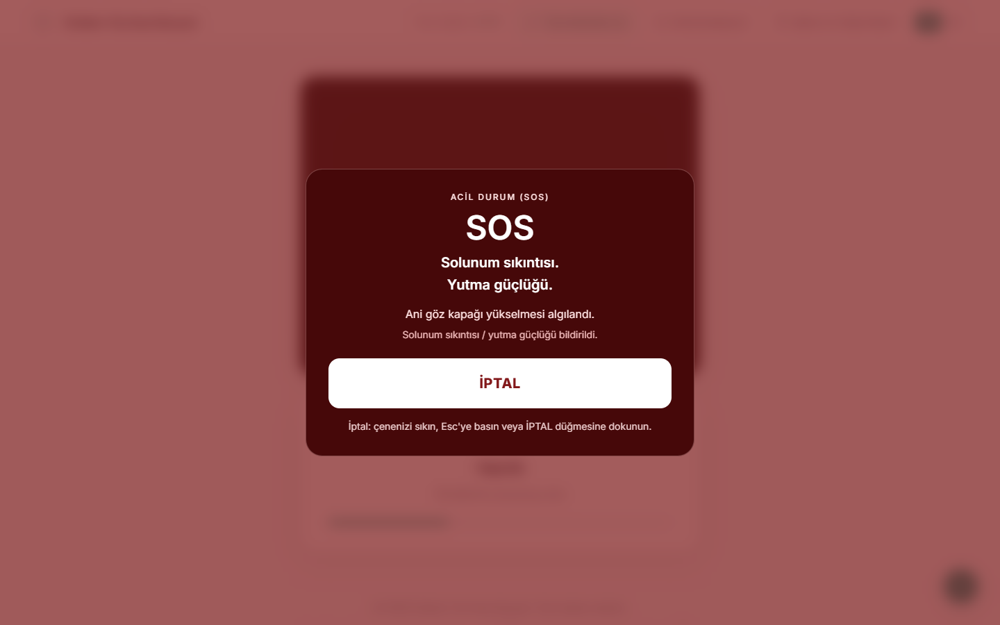

# Generative Facial Muscle Keyboard

A concept-focused AAC app in the browser. The user selects keywords with facial muscles; Gemini writes one Turkish sentence. The face mesh stays on this device. There is no login.

It is not limited to ALS. When motor control, speech, or fatigue makes typing hard, the same path still works.

**Live:** [uretken-klavye.vercel.app](https://uretken-klavye.vercel.app)

<p align="center">
  
</p>

## How it works

The user does not type letters. They select concepts from a grid (`Water`, `Cold`). The sentence is built only from those words:

> I want cold water.

Unselected objects, emotions, temperature, or time are not added. The default selection method is a jaw clench (masseter).

<p align="center">
  
</p>

Sentences are produced with Google Gemini (`gemini-2.0-flash`). If the key is missing or the request fails, the sentence is built on this device with a local template.

## Safety

A neurologist’s clinical notes informed the default jaw trigger, the spasm filter, the unhurried 5–8 second selection window, and the SOS path. This is an AAC communication aid, not a medical device.

<p align="center">
  
</p>

- **Fail-safe:** three long blinks within 6 seconds, then a 5-second cancel window (jaw, Esc, or Cancel). Short blinks do not cancel.
- **SOS:** a sudden eyelid raise or a long jaw hold. Thresholds are not lowered. SOS stays on in rest mode.
- **Care panel:** name, caregiver phone, personal words, voice notes, and a printable session summary. Names do not appear on the keyboard.
- The camera opens only on HTTPS or localhost, after the first-session protocol is confirmed.

## Development

```bash
npm install
```

Copy `.env.example` to `.env.local`, then `npm run dev`.

- App: [http://localhost:3000](http://localhost:3000)
- Documentation: [http://localhost:3000/docs](http://localhost:3000/docs)
- Care panel: [http://localhost:3000/bakim-ve-takip-paneli](http://localhost:3000/bakim-ve-takip-paneli)

The app can be added to the home screen from the browser menu. There is no heavy service worker, so MediaPipe and the camera session are not interrupted.

### Environment

| Variable | Purpose |
| --- | --- |
| `GEMINI_API_KEY` | Sentence generation (server-side only) |
| `GEMINI_MODEL` | Default: `gemini-2.0-flash` |
| `CAREGIVER_WEBHOOK_URL` | Optional caregiver webhook (server-side only) |
| `NEXT_PUBLIC_SITE_URL` | Public site URL |

`CAREGIVER_WEBHOOK_URL` is never sent to the browser. The care panel in the same browser sees live alerts through `BroadcastChannel` and `/api/live-alert`.

### Controls

| Input | Result |
| --- | --- |
| Jaw clench (recommended) | Selects the focused cell |
| Short blink | Selects only in blink mode |
| 3 long blinks / 6 s | Caregiver call |
| Space | Camera-free backup selection |
| E | Long-blink test |
| Shift+E | SOS test |
| Esc | Stops the alarm |
| TR / EN | Grid, copy, and speech |

Next.js, React, TypeScript, on-device MediaPipe Face Landmarker, Gemini with a local template fallback, Web Speech API, hosted on Vercel.

## License

MIT License. Copyright © 2026 Neşe Sağır.
